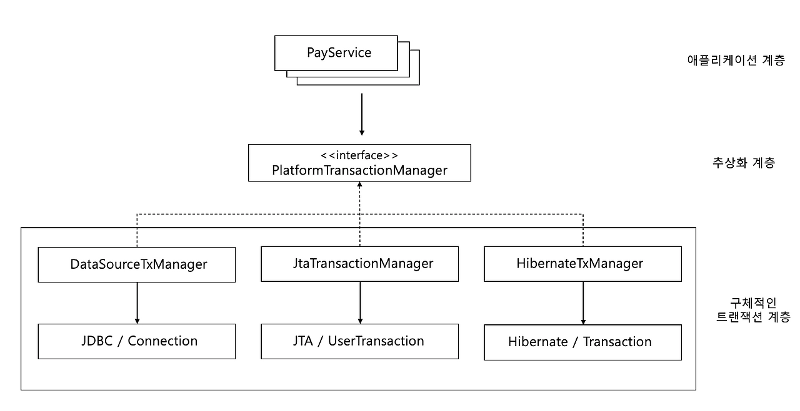
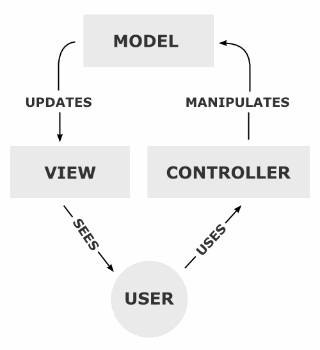
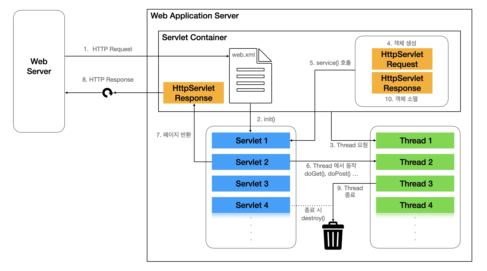
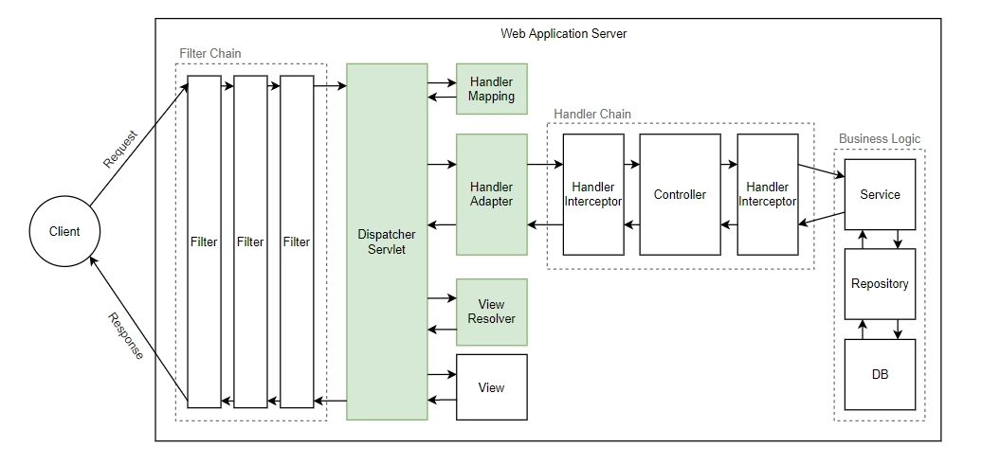

## AOP(Aspect-Oriented Programming)

관점 지향 프로그래밍. 핵심 비즈니스 로직(**`핵심관심사항`**)과 부가적인 기능(로깅, 보안 등)(**`공통관심사항`**)을 분리하여 모듈화하고, 이를 통해 코드의 재사용성, 유지보수성, 확장성을 높이는 프로그래밍 기법.

### AOP가 필요한 상황

공통 관심 사항: 1000개의 메소드의 호출 시간을 측정한다.
핵심 관심 사항: 각 메소드마다 핵심 비즈니스 로직이 들어있다.

**문제**

- 모든 메소드의 시간을 측정하는 로직은 `공통관심사항`이다.
- 시간을 측정하는 로직과 핵심 비즈니스의 로직이 섞여 유지보수가 어렵다.
- 시간을 측정하는 로직을 별도의 `공통 로직`으로 만들기 어렵다.
- 시간을 측정하는 로직을 변경할 때 모든 로직을 찾아가면서 변경해야 한다.
  **> AOP가 필요하다**


### AOP 적용


**해결**

- 회원가입, 회원조회 등 `핵심 관심사항`과 시간을 측정하는 `공통 관심사항`을 분리한다.
- 시간을 측정하는 로직을 별도의 공통 로직으로 만들었다.(AOP를 활용하여`@Aspect`)
- 핵심 관심사항을 깔끔하게 유지할 수 있다.
- 원하는 적용대상을 직접 선택할 수 있다.(`@Around`)

**동작방식**


- 스프링은 객체를 감싸는 프록시 객체를 생성해서, 공통 로직을 프록시에서 실행하고, 그 다음에 진짜 대상 객체를 호출한다.

  `Client -> Proxy -> Real Object`


```java
@Aspect
public class TimeTraceAop {

    @Around("execution(* hello.hello_spring..*(..))")
    public Object execute(ProceedingJoinPoint joinPoint) throws Throwable {
        long start = System.currentTimeMillis();

        System.out.println("START: " + joinPoint.toString());

        try {
            return  joinPoint.proceed();
        } finally {
            long end = System.currentTimeMillis();
            long timeMs = end - start;
            System.out.println("END: " + joinPoint.toString() + " " + timeMs + "ms");
        }
    }
}
```

## PSA (Portable Service Abstraction)

### 정의

- **Portable(이식 가능한)**: 코드를 다른 환경, 다른 기술로 옮겨도 그대로 동작
- **Service**: 트랜잭션, 캐시, 메일, 메시징 같은 인프라 서비스
- **Abstraction**: 공통 인터페이스로 감싸기

즉, **특정 기술에 종속되지 않도록 서비스를 인터페이스로 추상화해두고, 실제 구현체는 갈아 끼울 수 있게 만든 Spring의 설계원칙**이다.

구체적 예시로는 `@Transactional`이 있다. Spring은 트랜잭션 방식을 추상화하여 JDBC, JPA, Hibernate 등 다양한 기술 스택에서 일관된 방식으로 동작하게 한다.



### SA (Service Abstraction)

소프트웨어 개발에서 특정 서비스를 구현할 때, 구현 세부사항을 숨기고 인터페이스만을 제공하는 개념이다. 사용자는 세부 구현을 알 필요 없이, 추상화된 인터페이스를 통해 서비스를 사용할 수 있다.

**인터페이스**

```java
public interface PaymentService {
	void pay(double amout);
}
```

**구현체**

```java
public class CreditCardPaymentService implements PaymentService {
	
	@Override
	public voic pay(double amount){
		log.info("Paid={} using Credit Card", amount);
	}
}

public class PayPalPaymentService implements PaymentService {
	
	@Override
	public voic pay(double amount){
			log.info("Paid={} using Paypal", amount);
	}
}
```

**PaymentConfig**

```java
@Configuration
public class PaymentConfig {
	
	@Bean
	public PaymentService paymentService(){
		return new CreditCardPaymentService(); // 유동적으로 교체 가능
		return new PayPalPaymentService();
	}
}
```

PSA는 SA뿐 아니라 동일한 코드를 **`다양한 환경 (로컬, 클라우드, 온프레미스)에서 재사용할 수 있도록`** 설계된 추상화이다.

## 스프링 어노테이션

프로그램 코드에 메타데이터를 주입하여, 컴파일러나 런타임 환경에서 이를 읽고 특정 동작을 수행하도록 지시하는 기능.

그 자체는 어떠한 실행 로직도 가지지 않는 껍데기에 불과하다.

### 내부 동작 흐름

[컴파일 타임]

1. `@interface`로 어노테이션 정의
2. 타깃(`UserService`)에 선언 + 속성값(`role=ADMIN`) 지정

[런타임]

1. `UserService` 빈 생성/초기화
2. `AbstractAutoProxyCreator`가 UserService의 메서드를 리플렉션으로 순회하며 포인트컷(`@RoleCheck`) 매칭 → 어노테이션 프록시 생성
3. 매칭되면 UserService AOP 프록시 생성

[호출 시점]

1. `deleteUser()` 호출 → AOP 프록시가 어드바이스 체인 실행
2. 어드바이스가 어노테이션 프록시에서 `role()` 조회

**리플렉션**

자바 프로그램이 실행 중에 `자기 자신의 내부 구조를 엑스레이처럼 들여다보고 조작할 수 있게 해주는 기능`.

### 예시

```java
// 어노테이션 정의
@Retention(RetentionPolicy.RUNTIME) // 언제까지 살아남나 -> RUNTIME = 리플렉션
@Target(ElementType.METHOD) // 어디에 붙일 수 있나 -> METHOD는 클래스 내부 메서드
public @interface RoleCheck {
	String role() default "USER";
}

// 어노테이션 사용
public class UserService {
	
	@RoleCheck(role = "ADMIN")
	public void deleteUser(){
		log.info("유저 삭제 로직");
	}
}

// 리플렉션을 이용한 어노테이션 분석 및 동작
public class AnnotationTest {
    public static void main(String[] args) throws Exception {
    
        // UserService 클래스의 deleteUser 메서드 정보를 리플렉션으로 가져옴
        Method method = UserService.class.getMethod("deleteUser");

        // 메서드에 선언된 @RoleCheck 어노테이션 객체 추출
        RoleCheck annotation = method.getAnnotation(RoleCheck.class);

        if (annotation != null) {
            // 프록시 객체에 담긴 값을 읽어옴
            System.out.println("설정된 권한: " + annotation.role()); // ADMIN
            
            // 어노테이션 객체의 실제 클래스 타입 확인
            System.out.println("어노테이션 구현체 타입: " + annotation.getClass().getName()); // com.sun.proxy.$Proxy1
        }
    }
}
```

### 어노테이션 기반 Bean 등록 과정

1. **설정 읽기**: `@Configuration`이 붙은 설정 클래스나 `@SpringBootApplication`을 로드하여 애플리케이션의 시작점 인식
2. **컴포넌트 스캔**: 지정된 기준 패키지부터 하위 패키지까지 탐색하여 빈으로 등록할 대상 클래스들을 찾는다.
3. **BeanDefinition 생성**: 찾아낸 클래스들의 메타데이터(클래스 이름, 스코프, 의존성 등)를 담은 `BeanDefinition` 설계도 객체를 생성해 레지스트리에 등록
4. **인스턴스화 및 DI**: `BeanDefinition`을 바탕으로 실제 객체를 메모리에 생성하고, `@Autowired` 등을 확인하여 의존성을 주입
5. **초기화**: `@PostConstruct`가 선언된 메서등 등 초기화 콜백을 실행하여 빈을 완성 상태로 만든다.

### @ComponentScan의 컴포넌트 탐색 과정

**시작점**

```java
@SpringBootApplication // <- 를 상속한 @ComponentScan부터 탐색 시작
public class Application {}
```

1. 패키지명을 파일 경로 패턴으로 변환

   `com.example.demo → classpath*:com/example/demo/**/*.class`

   `PathMatchingResourcePatternResolver`가 이 패턴으로 클래스패스 전체를 탐색해 `.class` 파일 목록을 모은다.

2. 바이트코드를 읽는다.

   ASM 라이브러리로 `.class` 파일 바이트를 직접 파싱한다.

3. 필터로 걸러낸다.

   `@Component`가 붙었는지 본다.

4. 이름을 붙여 등록

   `AnnotationBeanNameGenerator`가 이름을 정한다. 그리고 레지스트리에 등록.


### 여러 구현체가 있는 인터페이스의 의존성 주입

하나의 인터페이스를 구현한 클래스가 여러 개일 때, `@Autowired`만 사용하면 스프링은 어떤 빈을 주입해야 할지 몰라 `NoUniqueBeanDefinitaionException` 에러를 발생시킨다. 이를 해결하는 방법 3가지

| 해결 방법 | 설명 | 활용 시기 |
| --- | --- | --- |
| @Primary | 여러 구현체 중 주입될 우선순위를 가진 빈을 지정 | 메인으로 사용하는 기본 구현체가 명확할 때 |
| @Qualifier | 주입받는 곳에 `Qualifier("빈이름")`을 적어 특정 구현체를 명시 | 특정 로직에서 명시적으로 다른 서브 구현체를 사용해야 할 때 |
| Collection 주입 | `Map<String, 인터페이스>` 형태로 모든 구현테를 주입받는다. | 런타임 조건에 따라 사용할 구현체를 동적으로 선택 (`전략 패턴`)해야 할 때 |

**@Primary**

```java
@Component
@Primary
public class RateDiscountPolicy implements DiscountPolicy {}
```

**@Qualifier**

```java
@Component
@Qualifier("mainDiscountPolicy")
public class RateDiscountPolicy implements DiscountPolicy{}

// @Qualifier가 붙은 RateDiscountPolicy로 DI
@Autowired
public OrderServiceImpl(MemberRepository memberRepository, @Qualifier("mainDiscountPolicy") DiscountPolicy discountPolicy)
```

**Collection 주입**

```java
@Service
@RequiredArgsConstructor
@Slf4j
public class BacktestService {

    private final Map<String, BacktestStrategy> strategyMap;

    /***
     * 전달받은 종목코드, 투자성향, 시작일, 종료일을 기준으로 백테스트 전략을 수행한다.
     * @param stockCode 종목 코드
     * @param investType 투자 성향 (1~5)
     * @param startDate 시작일
     * @param endDate 종료일
     * @return BacktestResDto.QuantScoringResponse
     */
    @Transactional
    public BacktestResDto.QuantScoringResponse runStrategy(
            String stockCode, int investType, LocalDate startDate, LocalDate endDate){

        // 생략...

        // 전략 구축
        Strategy strategy;
        try {
            strategy = strategyMap.get(strategyName).strategy(series);
        } catch (NullPointerException e){
            throw new BacktestException(BacktestErrorCode.STRATEGY_NOT_FOUND);
        }
```

## Spring MVC

### MVC



Model View Controller의 약자로 애플리케이션을 세가지의 역할로 구분한 개발 방법론. 그림처럼 사용자가 `컨트롤러`를 조작하면 `컨트롤러`는 `모델`을 통해서 데이터를 가져오고 그 정보를 바탕으로 시각적인 표현을 담당하는 `뷰`를 제어해서 사용자에게 전달한다.

### 웹으로 오면서 (Spring MVC)

HTTP는 요청-응답이 끝나면 연결이 끊긴다. 그래서 `모델`이 `뷰`에게 알려줄 방법이 없다.

그래서 웹에서는 `뷰`가 `모델`을 관찰하는 게 아니라, `컨트롤러`가 `모델`을 만들어 `뷰`에 밀어 넣는다.

→ MVC는 **역할을 셋으로 나눠라**는 원칙

→ Spring MVC는 **그 원칙을 서블릿 위에서 컨트롤러 패턴으로 구현한 구체적인 프레임워크**

## Tomcat과 WAS, 서블릿과 웹 요청 처리

|  | 웹 서버 | WAS (웹 애플리케이션 서버) |
| --- | --- | --- |
| 대표 | Nginx | Tomcat |
| 처리 대상 | 정적 리소스 | 동적 콘텐츠 |
| 구성 | HTTP 처리 | HTTP 처리 + 애플리케이션 컨테이너 |



- 서블릿 컨테이너 (Tomcat)
    - 역할: 서블릿들을 관리. 요청에 따라 동적으로 응답 생성
- 스프링 DI 컨테이너
    - 역할: 빈 생명 주기 관리, 싱글톤 유지
- 그림에서 어느 부분에 DI 컨테이너가 개입?
    - 스프링은 `DispatcherServlet`이라는 단 1개의 거대한 대표 서블릿만 만들어 두고 모든 요청을 다 받는다. (`즉, 그림에서 파란색 Servlet이 하나만 존재`)
    1. `init()` 호출 시점 (스프링 컨테이너의 탄생)
        - Tomcat이 켜지고 `DispatcherServlet`을 생성하면서 `init()` 메서드를 호출.
        - 바로 이때 `DispatcherServlet`은 내부에 스프링 컨테이너(`ApplicationContext`)를 생성.
        - 그리고 작성한 `@Controller`, `@Service`, `@Repository`같은 클래스들을 Bean으로 만들어서 스프링 컨테이너라는 보관함에 싹 올려두고 의존성 주입을 완료함.
    2. `service()`호출 및 스레드 동작 시점 (스프링 컨테이너의 활약)
        - 클라이언트의 요청이 오면 Tomcat이 스레드를 하나 뽑아서 `DispatcherServlet`의 `service()` 메서드를 실행. (이때부터 Tomcat의 역할은 끝이고, 스프링의 주도권 시작.)
        - `DispatcherServlet`은 자신이 품고 있는 스프링(`DI`) 컨테이너에게 물어봄.

          “지금 `/api/items`라는 URL로 요청이 왔는데, 네가 관리하는 Bean 중에 이거 처리할 `@Controller` 누구야?”

        - 스프링 컨테이너가 알맞은 컨트롤러 Bean을 찾아주면, 그 컨트롤러의 로직을 실행하고 결과를 받아옴.
    3. 종료 시점 (`distroy()`)
        - Tomcat 서버가 종료될 때 `DispatcherServlet`의 `destroy()`가 호출되며, 내부에 있던 스프링(`DI`) 컨테이너도 함께 파괴되면서 관리하면 Bean들도 소멸.

## DispatcherServlet 동작 원리

디스패처 서블릿: 모든 요청을 가장 먼저 받는 `프론트 컨트롤러`. 요청을 직접 처리하지 않고 적절한 컨트롤러를 찾아 위임하는 `중앙 집중형 서블릿 구현체`이다.

1. **서블릿 요청을 HTTP로 캐스팅 → HTTP 메서드에 따라 분기**

   필터들을 통과한 요청이 가장 먼저 닿는 곳이 `HttpServlet`의 `service()`이다. `ServletRequest/ServletResponse`를 HTTP용 타입으로 형변환하고, 실패하면 HTTP 요청이 아니라는 뜻이므로 예외를 던진다.

    ```java
    protected void service(HttpServletRequest req, HttpServletResponse resp) throws ServletException, IOException {
    
        String method = req.getMethod();
    
        if (method.equals(METHOD_GET)) {
            long lastModified = getLastModified(req);
            if (lastModified == -1) {
                // servlet doesn't support if-modified-since, no reason
                // to go through further expensive logic
                doGet(req, resp);
            } else {
                long ifModifiedSince;
                try {
                    ifModifiedSince = req.getDateHeader(HEADER_IFMODSINCE);
                } catch (IllegalArgumentException iae) {
                    // Invalid date header - proceed as if none was set
                    ifModifiedSince = -1;
                }
                if (ifModifiedSince < (lastModified / 1000 * 1000)) {
                    // If the servlet mod time is later, call doGet()
                    // Round down to the nearest second for a proper compare
                    // A ifModifiedSince of -1 will always be less
                    maybeSetLastModified(resp, lastModified);
                    doGet(req, resp);
                } else {
                    resp.setStatus(HttpServletResponse.SC_NOT_MODIFIED);
                }
            }
    
        } else if (method.equals(METHOD_HEAD)) {
            long lastModified = getLastModified(req);
            maybeSetLastModified(resp, lastModified);
            doHead(req, resp);
    
        } else if (method.equals(METHOD_POST)) {
            doPost(req, resp);
    
        } else if (method.equals(METHOD_PUT)) {
            doPut(req, resp);
    
        } else if (method.equals(METHOD_DELETE)) {
            doDelete(req, resp);
    
        } else if (method.equals(METHOD_OPTIONS)) {
            doOptions(req, resp);
    
        } else if (method.equals(METHOD_TRACE)) {
            doTrace(req, resp);
    
        } else {
            //
            // Note that this means NO servlet supports whatever
            // method was requested, anywhere on this server.
            //
    
            String errMsg = lStrings.getString("http.method_not_implemented");
            Object[] errArgs = new Object[1];
            errArgs[0] = method;
            errMsg = MessageFormat.format(errMsg, errArgs);
    
            resp.sendError(HttpServletResponse.SC_NOT_IMPLEMENTED, errMsg);
        }
    }
    ```

2. **공통 전처리**

   `doGet()`, `doPost()` 등 `doX` 메서드들은 자식인 FrameworkServlet에 오버라이드되어 있고, 모두 `processRequest()`를 부른다. (템플릿 메서드 패턴)

3. **doDispatch()**

   

    ```java
    protected void doDispatch(HttpServletRequest request, HttpServletResponse response) throws Exception {
        ...
        processedRequest = checkMultipart(request);
    
        // 1. 요청에 매핑되는 HandlerExecutionChain 조회
        mappedHandler = getHandler(processedRequest);
        if (mappedHandler == null) {
            noHandlerFound(processedRequest, response);
            return;
        }
    
        // 2. 요청을 처리할 HandlerAdapter 조회
        HandlerAdapter ha = getHandlerAdapter(mappedHandler.getHandler());
    
        // 3. 어댑터를 통해 컨트롤러 호출
        mv = ha.handle(processedRequest, response, mappedHandler.getHandler());
        ...
        processDispatchResult(processedRequest, response, mappedHandler, mv, dispatchException);
    }
    ```

    1. **HandlerExcecutionChain 조회**

       `getHandler()`는 등록된 `HandlerMapping` 목록을 순회하며 처리 가능한 것을 찾는다.

       **HandlerMapping (핸들러 매핑)**

        - `0 = RequestMappingHandlerMapping`: 어노테이션 기반의 컨트롤러인 @RequestMapping에서 사용
        - `1 = BeanNameUrlHandlerMapping`: 스프링 빈의 이름으로 핸들러를 찾는다.
    2. **HandlerAdapter 조회**

       디스패서 서블릿은 찾아낸 핸들러를 직접 실행하지 않는다. `HandlerAdapter`라는 어댑터 인터페이스를 통해 실행한다.

       **HandlerAdapter (핸들러 어댑터)**

        - `0 = RequestMappingHandlerAdapter`: 어노테이션 기반의 컨트롤러인 @RequestMapping에서 사용
        - `1 = HttpRequestHandlerAdapter`: HttpRequestHandler 처리
        - `2 = SimpleControllerHandlerAdapter`: Controller 인터페이스 처리
    3. 컨트롤러 호출

       내가 작성한 로직 실행